<h1>싸강두천 - 천재들의 싸움은 외나무다리에서 피어난다</h1>

<h2>목차</h2>
1. [개요](#개요)  
2. [개발환경](#개발환경)  
3. [서비스 화면 및 기능](#서비스-화면-및-기능)  
4. [팀원 소개](#팀원-소개)  

<h2>개요</h2>
경쟁 모드, 솔로 모드의 재밌는 시스템을 활용하여 학습 습관, 의지를 기르는 SNS 서비스

<h2>개발환경</h2>
Management Tool  
JIRA, GitLab, MatterMost, Notion, FIGMA
IDE  
VSCode, Intellij
infra  
AMAZON AWS, AMAZON S3, NGINX, DOCKER, UBUNTU
Frontend  
HTML, CSS, JAVASCRIPT, Vue.js
Backend  
JAVA, SpringBoot, Spring Security, Spring JPA, JWT, SWAGGER, MySQL

<h2>서비스 화면 및 기능</h2>
<h3>로그인</h3>
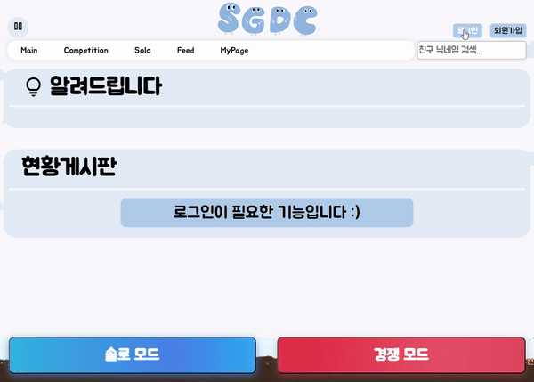 
[상세 기능]  
- 아이디와 비밀번호를 입력 후 로그인 버튼을 누르면 로그인 완료  
<h3>피드 게시판</h3>
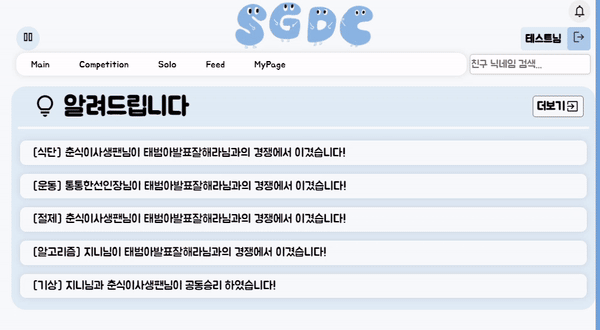 
[상세 기능]  
경쟁을 진행한 사람의 인증 사진이 올라가는 피드 게시판  
- 해당 사람의 프로필, 닉네임, 인증 이미지, 대표 뱃지, 좋아요, 조회수 확인 가능  
- 아래로 스크롤을 내리며 피드 확인 가능
<h3>피드 게시판 신고</h3>
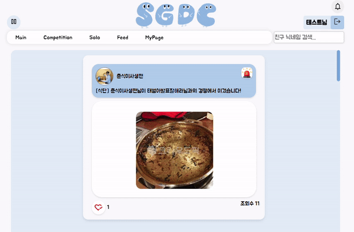 
[상세 기능]  
거짓 인증을 한 사람을 신고할 수 있는 기능  
- 신고 사유 입력 가능
<h3>솔로 모드</h3>
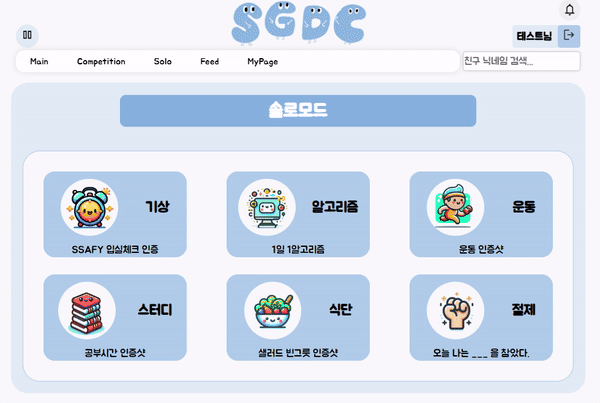 
[상세 기능]  
혼자 사진을 올리며 일기처럼 기록하는 기능  
- 하루에 한 번 솔로모드 진행 가능  
- 해당 카테고리 버튼을 누르면 해당 솔로 모드를 진행하는 지 확인  
- 솔로 모드가 생성되며 사진 인증 창으로 넘어감
<h3>메인페이지 솔로 모드 인증</h3>
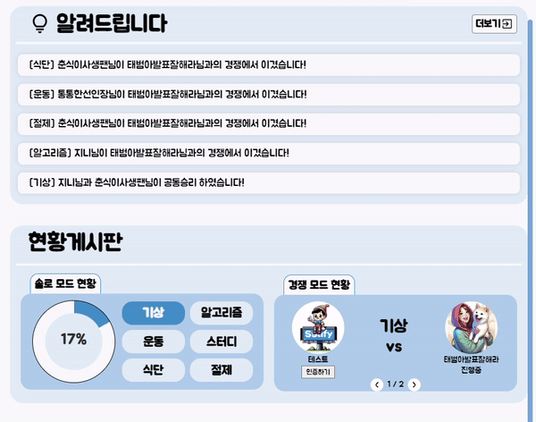 
[상세 기능]  
- 사진 버튼을 누르고 인증 할 사진을 올리면 해당 카테고리는 완료
<h3>경쟁 및 솔로모드</h3>
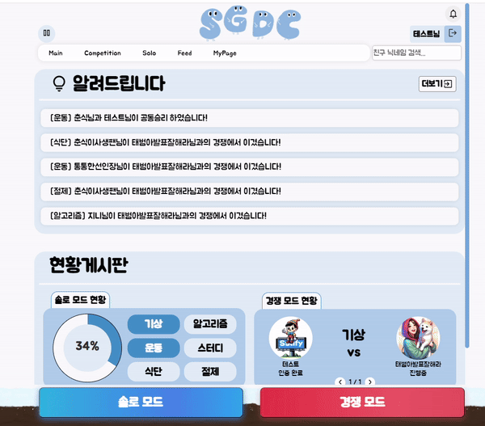 
[상세 기능]  
- 해당 카테고리를 진행했으면 더 이상 진행할 수 없음  
- 솔로 모드 버튼을 누르면 솔로 모드 페이지로 이동  
- 경쟁 모드 버튼을 누르면 경쟁 모드 페이지로 이동
<h3>알림창</h3>
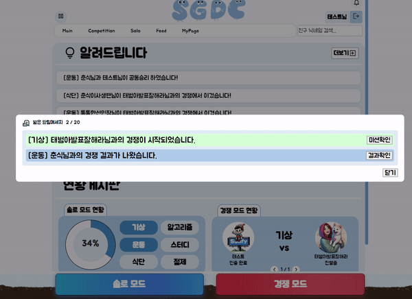 
[상세 기능]  
경쟁 결과와 도전장 등 다양한 알림을 받을 수 있는 기능  
- 경쟁 시작 알림 (미션 확인으로 진행도 확인 가능)  
- 경쟁 종료 알림 (결과 확인으로 경쟁 결과 확인 가능)
<h3>도전장함</h3>
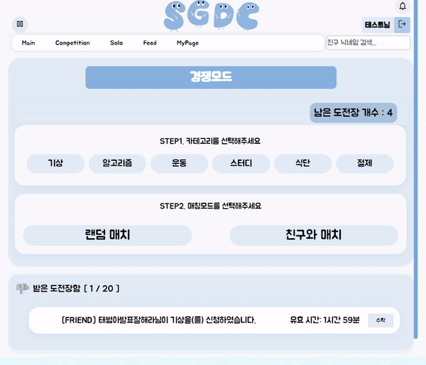 
[상세 기능]  
받은 도전장을 확인할 수 있는 기능  
- 해당 도전장을 수락하면 경쟁 시작하고 도전장이 사라짐  
- 도전장 만료 시간 확인 가능
<h3>마이페이지</h3>
 
[상세 기능]  
- 마이페이지에서 도전장함 버튼을 누르면 도전장함 확인 가능  
- 마이페이지에서 쌀로우 가능
<h3>마이페이지 수정</h3>
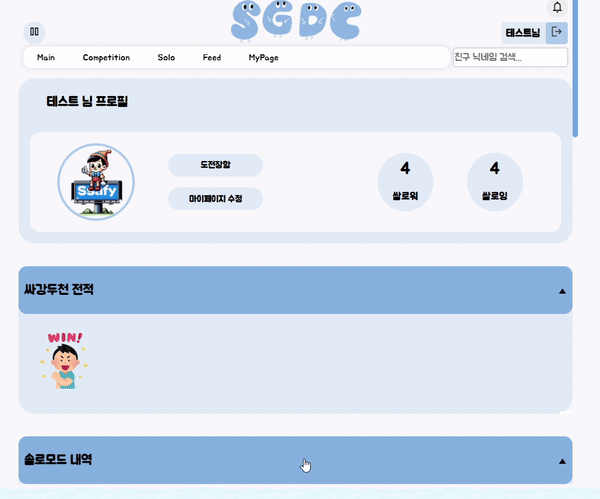 
[상세 기능]  
마이페이지로 유저 정보 수정 가능  
- 닉네임, 대표뱃지, 전화번호, 프로필 이미지 수정 가능
<h3>마이페이지 쌀로우</h3>
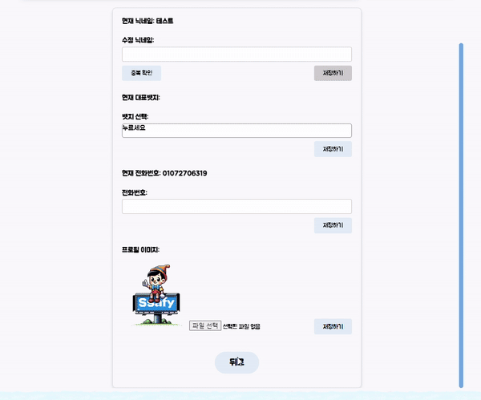 
[상세 기능]  
- 쌀로워, 쌀로잉 버튼을 누르면 유저와 쌀로워, 쌀로잉 중인 현황 확인 가능  
- 각각 유저의 프로필 페이지 이동 기능 및 쌀로우, 언쌀로우 기능
<h3>전적</h3>
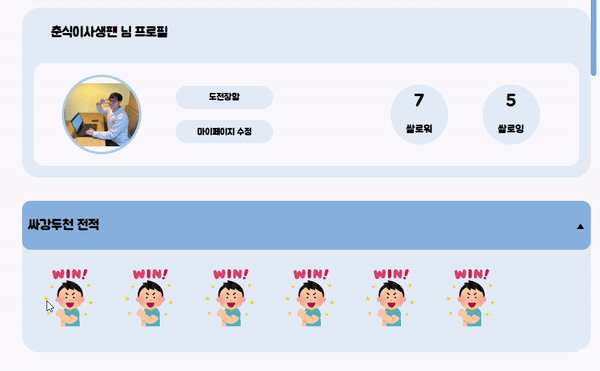 
[상세 기능]  
지난 경쟁 전적, 경쟁 카테고리별 승률 확인 가능  
- 해당 전적 버튼을 누르면 경쟁 결과 상세 조회 가능
<h3>마이페이지</h3>
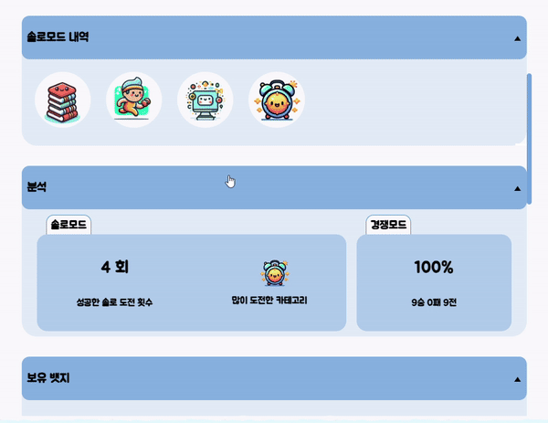 
[상세 기능]  
- 솔로 전적  
- 뱃지  
- 승률  
- 도전 현황  

